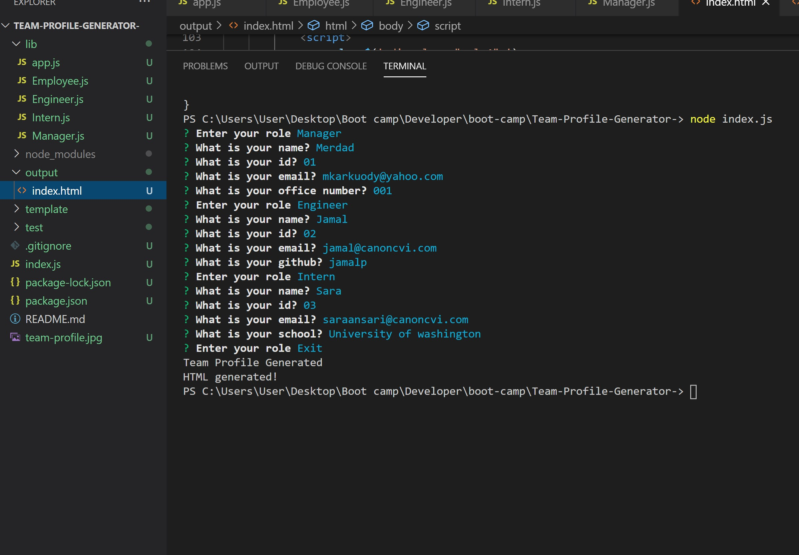
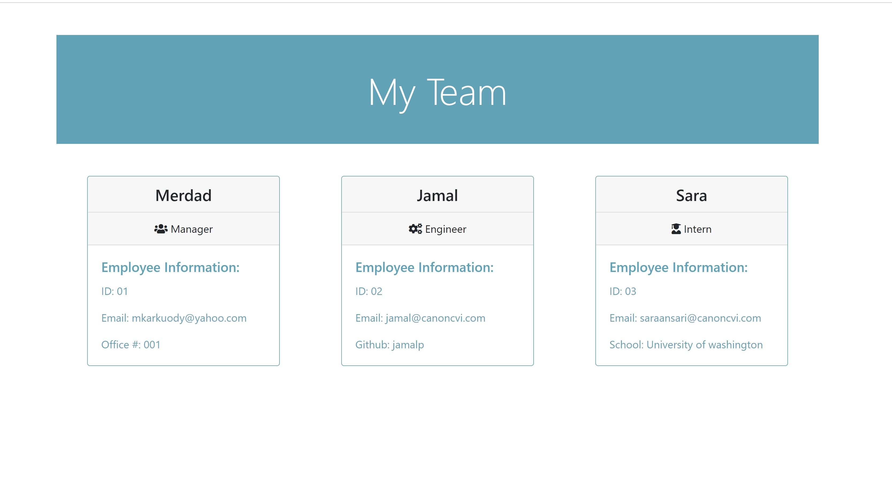

# Team-Profile-Generator- By Merdad Karkudi
# Description
Create an html profile for your whole team by gitting user answers by prompt and get thoes inputs and attach them on the main html.

# project repository link : 
https://github.com/mkarkuody/Team-Profile-Generator-

# Table of Contents
Screenshots
Installation
Usage
Credits

# Screenshots

# demo video link :

#Installation
Steps to install application:
loaded npm init to create package.json.
loaded npm i inquirer to take response from user with prompt.
used Jest to test the files.

# Usage
to build an app and create a team and manage the user input and ajust the data.

# Credits:
Got help Online from : 
•	https://www.google.com/
•	https://www.w3schools.com/  
•   https://nodejs.org/en/
•	www.YouTube.com 
 Thanks to John Young my class instructor and Ben Vaagen my TA. special Thanks to Abdul Aziz my TA and Amanda Crawford My Tutor for helping me to understand the class and homework contents.
How to create a team with this app;
Clone repository.
In the directory with index.js run npm install
Start server and answer prompts
HTML Generated